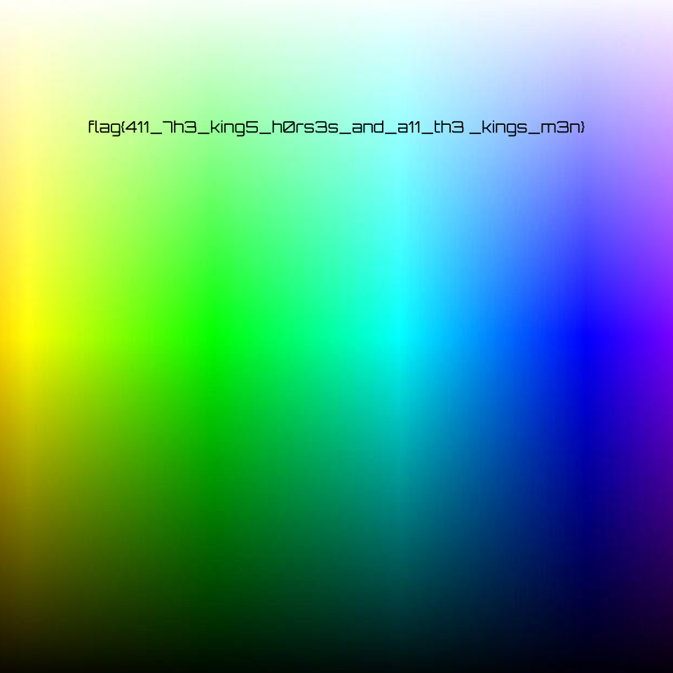

# MHSCTF - General

## Binned (5 pts)

> If you have the number 1001000 in binary, what number is that in decimal?  Enter your answer in the flag format: "flag{###}"

`1 * 2^6 + 1 ^ 2*3 = 64 + 8 = 72`

**Flag:  `flag{72}`**

## Where the Wild Cards Are (10 pts)

Regex: `[a-z,0-9,{,},_](?=[0-D][T-Z]{7,14})`

Data:

```text
#Qn0Uf5WYTVUUWYWIW>\*7Wtb/YU/s9l7VUYTWXTY%8TaCTZVTYTWZTXZXVwgDVZUUTUUYUXWV`C2dvR~4=zz-pHno;zJ+Ec|_{>YTYXWZYZTZVXt&\0~p6kS-qBD&}(xxVtVLr-qBk!Jtq(,3Y0CZUWUTWUZAN:&Vu@UYXVUUWWt=UTZVUXTVTZ)_DWTWWZUZWTYUF0c8WAtl"12ZXTTWWXXWXWXY!mx=nBUYTWXWTZXY%_=ZZZTTZTVVXZ"<O[9+7<TYXZYTYUUYUWZhDVTVZVXTW/;s$a''Tk.@!j{eAXTVYTZTYTVU#1y\-8J_4ZUVUUXXVZXZYmkAQjVz-}}9rgLvw2YWXWWXUVVX\aJ.%\gd>Tb>3{\]6:JQ$J.4rri%(mE\F#i4WYWZZWTYWWZZXV"?XTHA9@;jMTBwt0Or[:g+RL_Z:+P8^_m_jobkEl8TZUUWZXYpd<UWYTVZWWWUWWx#p37,~$};VWVYYYXT]j&F4e2}eZDVu`K!dYhL=%D:cSEL`~B$i}GTEjeJ@dIfrX*s3%\=}M6-"wlWtiv99V&PtW93SKPMY`zF}a)>C"'BUHIR`<pN|}5I[cV[H2i1zZys>dv=5z]\(-rf9;3u=\;cFe$.5PiXz&Ew4i.D#+3ZNo.U7geS3`y-rVi"da]_m<oGf4(F`6exx/@7HxoaW;TwcDO`KF*@'O6S
```

Using regex sandbox at [regex101](https://regex101.com) I found the flag.

**Flag: `flag{0ut_1n_7he_wild}`**

## Perspective (10 pts)

> Can you get the right perspectives? Enter your answer in the flag format: "flag{...}"

The file given was 3D drawing, which should be rotated to a certain angle:


**Flag: `flag{free}`**

## Transposer (15 pts)

> I've intercepted this critical file, but it just seems like gibberish!I'll need you to get the flag for me!

The file is a wall of text, 100 lines with 100 characters per line. The most obvious solution is that it needs to be transposed on letter to letter basis.

Using Linux commands `sed`, `rs` and `grep`,

```bash
~$ sed -e 's/./& /g' -e 's/ $//' tpose.txt | rs -Tng0 | grep flag
3ef80p0c6i6zdqflag{lott4_t3xt_t0_r34d!}3vgyyq0fr82e_yp-gbda8vs53f3vjkoj8sv7zbjf95go_ng23qod_14uenpg0
```

**Flag: `flag{lott4_t3xt_t0_r34d!}`**

## Where Wild Cards Are 2 (15 pts)

> Now, try writing some regex on your own! mhsctf-wherethewildcardsare2.0xmmalik.repl.co (you may need to wait for the site to wake up)

The link connects to a quiz about regex. Here are the answers.

*Example: All lowercase letters: `[a-z]`*

All lowercase Letters followed by 2+ capital letters and 3+ digits (the latter two themselves not in match): `[a-z](?=([A-Z]{2,}\d{3,}))`

All numbers, letters, underscore: `\w`

Getting both questions right leads to the flag.

**Flag: `flag{m@tc#_mak3r}`**

## Reconstruction (35 pts)

> I received an interesting file that's supposed to create a picture, but I'm not exactly sure how. Wanna give it a shot?

The [file](docs/recon.txt) is a single long line of text composed of series of numbers, with occasional semicolons.

Given that every number in it does not go over 255, it is assumed to be RGB codes and the semicolons function as line breaks.

I wrote [a script](docs/recon.py) to convert these numbers to image.

```python
import numpy as np
from PIL import Image, ImageDraw

colorfile = open("recon.txt", "r")

untreated = colorfile.read()
treated = untreated.split(",")

nums = []
w = 0
h = 0

for val in treated:
    if val == ";":
        h += 1
        w = int(w / 3)
        break
    elif val[0] == ";":
        h += 1
        nums.append(val[1:])
    else:
        if h == 0:
            w += 1
        nums.append(val)

a = np.array(nums, dtype=np.uint8).reshape((w, h, 3))

img = Image.fromarray(a,'RGB')

# Added later because the initial output was not legible
out = img.transpose(Image.FLIP_LEFT_RIGHT).transpose(Image.ROTATE_90) 

out.save("recon.png", bitmap_format='png')
```

The output:



**Flag: `flag{411_7h3_king5_h0rs3s_and_a11_th3_kings_m3n}`**

## 1 chal 2 categories (45 pt)

> This is a two-for-one deal! We have reverse engineering and forensics all bunched up into a single challenge! With two categories comes two files. Good luck!

The problem gives a [Python code](docs/1c2c.py) and an [encoded image](docs/encoded.png). The code describes a messy, 8-stage binary operation to encode a given image.

For each of 256 numbers it switches bits in this order:

| Orig. | 0 | 1 | 2 | 3 | 4 | 5 | 6 | 7 |
| ----- | - | - | - | - | - | - | - | - |
| 1st   | 6 | 1 | 2 | 3 | 4 | 5 | 0 | 7 |
| 2nd   | 6 | 2 | 1 | 3 | 4 | 5 | 0 | 7 |
| 3rd   | 6 | 2 | 0 | 3 | 4 | 5 | 1 | 7 |
| 4th   | 6 | 2 | 3 | 0 | 4 | 5 | 1 | 7 |
| 5th   | 6 | 2 | 3 | 0 | 1 | 5 | 4 | 7 |
| 6th   | 6 | 2 | 5 | 0 | 1 | 3 | 4 | 7 |
| 7th   | 6 | 2 | 5 | 0 | 1 | 3 | 4 | 7 |
| **Final** | **6** | **2** | **7** | **0** | **1** | **3** | **4** | **5** |

Therefore, to undo this, the decoding function should rearrange the bits like this:

```python
def unglorp(n):
    g = list(format(n,"08b"))
    o = [g[3], g[4], g[1], g[5], g[6], g[7], g[0], g[2]] # M
    return int(''.join(o),2)

lookup = [unglorp(i) for i in range(256)] # list of 256 unglorped nums (0-255)
```

Using [this decoder](docs/1c2cdecode.py), the following image is recovered:


There is a flag on the image, but it is divided into two parts and overlapped to each other. I am yet to reassemble this flag.

**Flag:** (unfinished)
